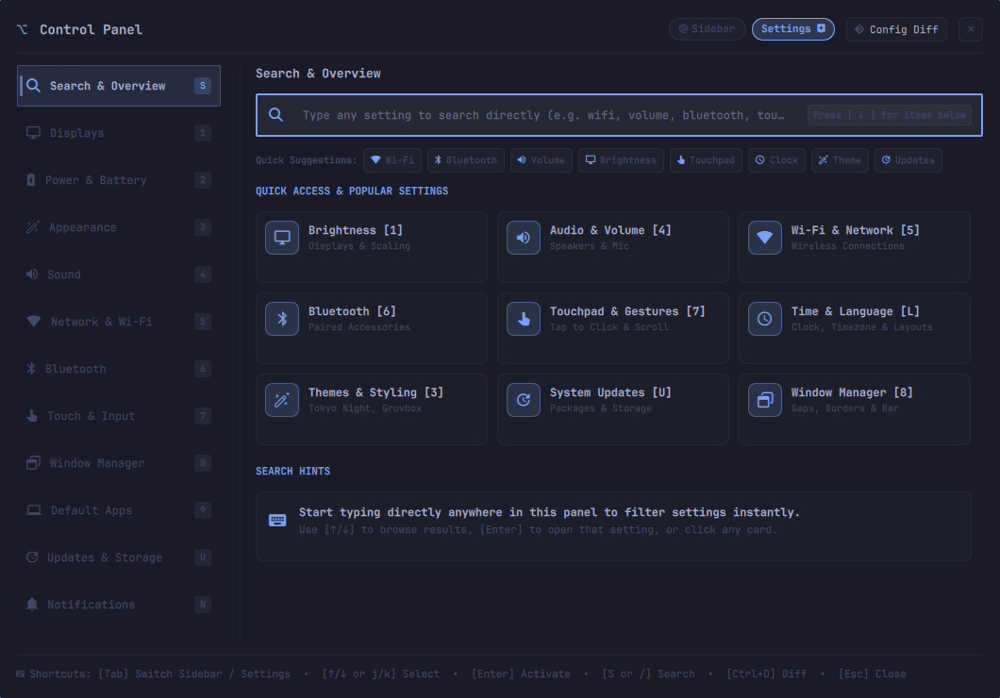
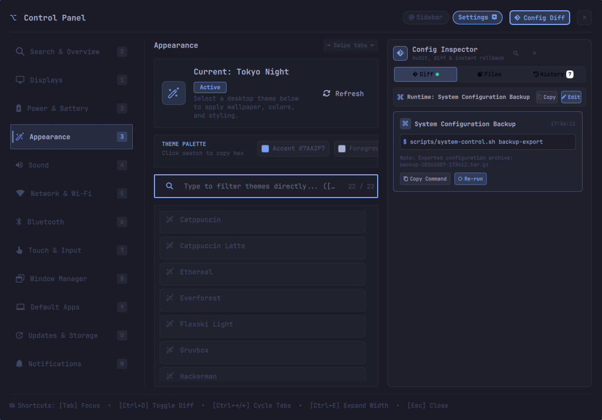
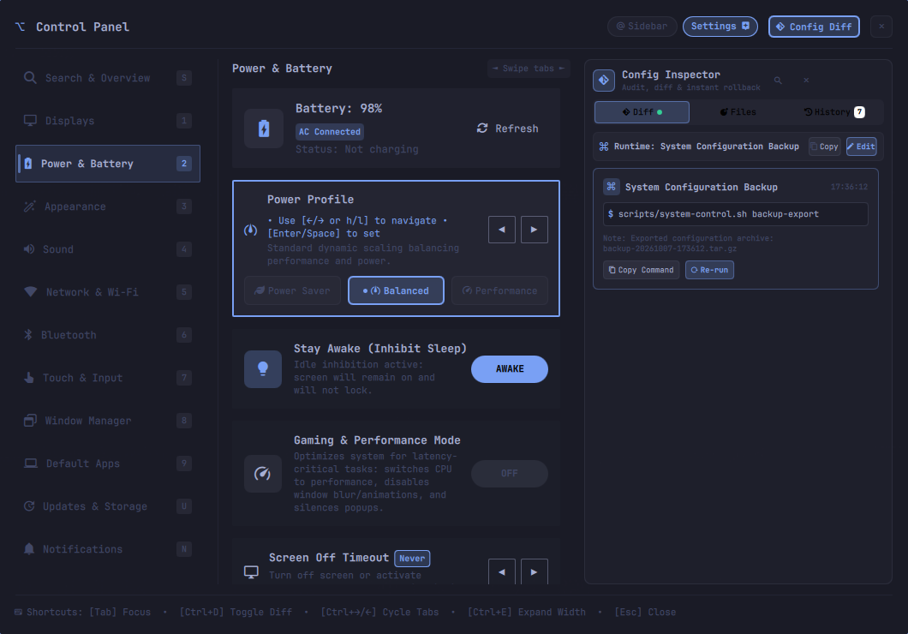
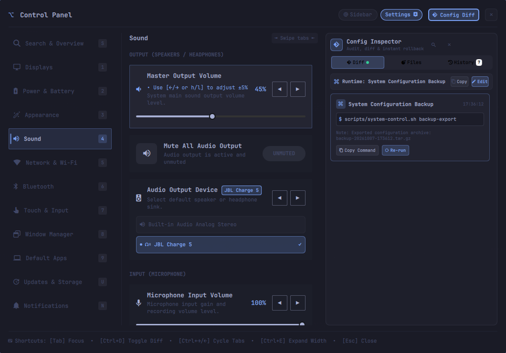
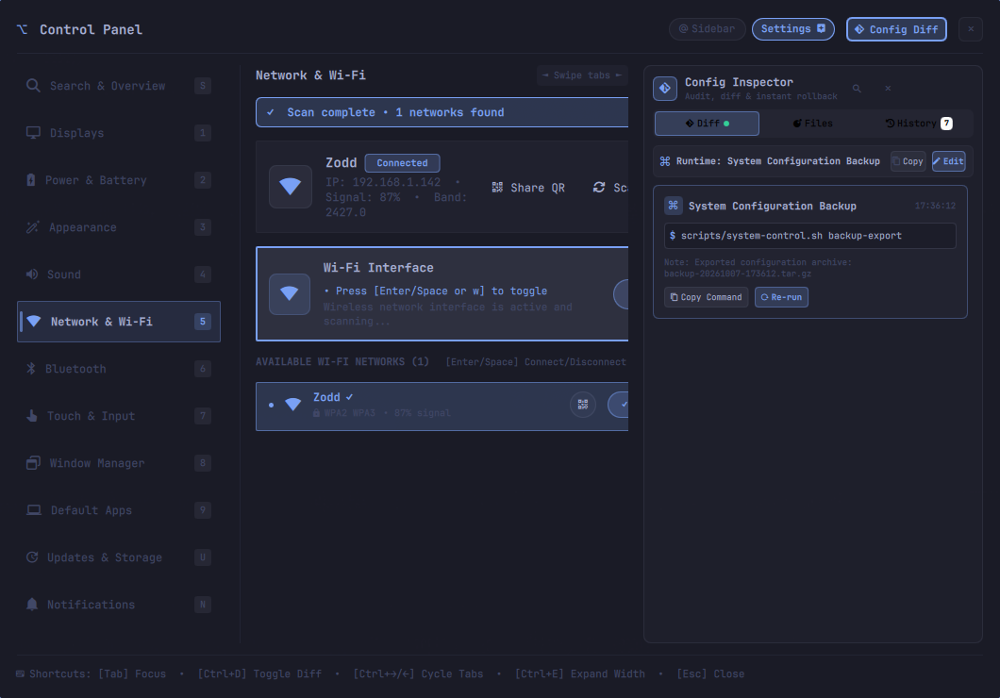
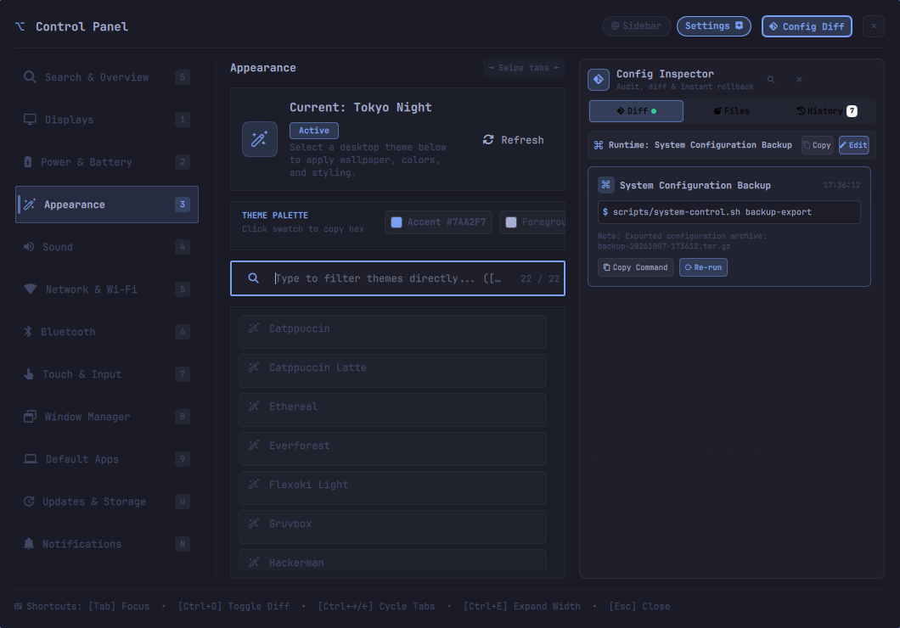

# Omarchy Control Panel (`ac.control-panel`)

[](https://github.com/atanas-chalakov/omarchy-control-panel/actions/workflows/test.yml)
[](LICENSE)
[](https://omarchy.org)

A comprehensive graphical settings and control panel plugin for **Omarchy Linux** and **Hyprland**, built with **Quickshell** and **QML**. It provides a macOS/GNOME-grade unified preferences hub designed with full keyboard-first ergonomics, live configuration tracking with two-column split diff inspection, one-click rollbacks, and full system backup/restore capabilities.

<p align="center">
  
</p>

---

## 📸 Visual Showcase

| Global Search & Overview | Live Diff Inspector & Revert Engine |
| :---: | :---: |
|  |  |

| Power & Gaming Mode Preset | Speaker Channel Audio Test |
| :---: | :---: |
|  |  |

| Wi-Fi Scanning & QR Sharing | Theme Palette Swatches |
| :---: | :---: |
|  |  |

---

## 🌟 Highlights & Features

### 🎛️ 16 Integrated Preference Categories
1. **Displays & Brightness** — Resolution, refresh rate, scaling (with zero-division GCD protection), screen arrangement, and night light.
2. **Sound & Audio** — Master volume/mute, application-specific playback streams, PipeWire/WirePlumber sink/source selection, and speaker channel testing.
3. **Power & Battery** — Active power profiles (`performance`, `balanced`, `power-saver`), battery telemetry, and idle sleep timeouts.
4. **Network & Wi-Fi** — Interface status, Wi-Fi network scanning, secure credential handling, and instant mobile QR code sharing.
5. **Bluetooth** — Adapter toggle, paired device list, connection management, and signal status.
6. **Appearance & Theming** — Instant system-wide theme switching across Omarchy color schemes and wallpaper synchronisation.
7. **Window Manager** — Hyprland animations, active window border thickness, and inner/outer gaps.
8. **Touch & Gestures** — Touchpad tap-to-click, natural scroll direction, and gesture controls.
9. **Keyboard & Region** — Layout selection, input switching, and date/time formatting.
10. **Shortcuts & Keybindings** — Searchable keybinding registry with quick edit integration.
11. **Default Applications** — Browser, text editor, terminal emulator, and MIME-type defaults.
12. **Notifications** — Do Not Disturb (DND) mode, notification history inspection, and alert sounds.
13. **Storage & Updates** — Disk partition usage breakdown, Pacman update checks, and pacman cache cleanup.
14. **Coding Agents** — Omarchy agent manager (Antigravity, Claude Code, Copilot, Codex, OpenCode) with default selector and token telemetry.
15. **System & Backups** — Hardware specifications, kernel info, uptime, timezone selector, local config backup/restore, and GitHub Gist cloud synchronization.
16. **Global Search** — Fast fuzzy search across all 71+ system settings with quick jump chips and direct navigation.

---

### 📱 Interactive Wi-Fi QR Code Sharing
Located in the **Network & Wi-Fi** view:
- **Instant Sharing**: Click **Share QR** on the active connection card or any saved network profile to generate a mobile-ready QR code.
- **High-Contrast Display**: Renders a crisp 1:1 QR container (`qrencode`) formatted with the `WIFI:T:WPA;S:...;P:...;;` standard for instant camera scanning on Android and iOS devices.
- **One-Click Credential Copying**: View connection details and copy SSID or WPA passphrase directly to system clipboard via `wl-copy`.

---

### 🔊 Speaker & Channel Audio Test Suite
Located in the **Sound & Audio** view:
- **Directional Sound Testing**: Dedicated buttons for **Stereo Chime** (`󰕾`), **Left Channel**, and **Right Channel** audio verification.
- **Universal Engine Support**: Backed by PipeWire (`pw-play`), PulseAudio (`paplay`), or libcanberra (`canberra-gtk-play`) with fallback system sound cues.

---

### 🎮 Gaming & High-Performance Mode Preset
Accessible directly in the **Power & Battery** view or via shortcut `[G]`:
- **Governor Switch**: Activates `powerprofilesctl set performance` for maximum clock scaling.
- **Compositor Optimization**: Disables Hyprland animations, background blur, drop shadows, and Variable Frame Rate (VFR) via batch IPC for minimum input latency.
- **Sleep & Popups**: Inhibits system idle sleep and silences intrusive alerts by activating Do Not Disturb (DND).
- **Clean Reversion**: Turning off Gaming Mode restores the previous CPU governor, reloads default Hyprland compositor effects, and re-enables notifications.

---

### 🎨 Theme Palette Inspector & Swatches
Located in **Appearance & Theming**:
- **Live Swatches**: Displays live hex color tokens (`Color.accent`, `Color.foreground`, `Color.background`, `Color.muted`) generated dynamically by Omarchy's active theme.
- **One-Click Copy**: Clicking any swatch copies the hex string to clipboard via `wl-copy` with visual confirmation.

---

### 🛡️ Live Config Diff Inspector & Rollback Engine
Every time a setting or theme changes, the Control Panel's background tracker records a state snapshot:
- **Two-Column Gutter Diffs**: Line-by-line visual inspection (`oldLine` vs `newLine`) of modified `.conf`, `.lua`, and `.json` files.
- **One-Click Revert**: Click **Revert Change** or press `[U]` to roll back any modified configuration file instantly to its exact previous state.
- **Audit History**: Persistent session log of all runtime CLI mutations and file modifications.
- **Expandable Drawer**: Expand the inspector into a full-height comparison split view (`[E]`).

---

### 📦 Configuration Backup & Cloud Sync (GitHub Gists)
Located in the **About & System** view:
- **One-Click Backup `[B]`**: Creates a compressed `.tar.gz` snapshot of your complete Hyprland setup (`~/.config/hypr/*.lua`, `*.conf`), Shell layout (`shell.json`), active defaults, and custom toggle states in `~/.local/state/omarchy/backups/control-panel/`.
- **Safe Selective Restore**: Validated archive extraction with automated path traversal protection, `hyprctl reload`, and shell restart.
- **Cloud Gist Synchronization `[S]`**: Upload local archives directly to private GitHub Gists with `gh`, browse remote backups, and import/download archives across workstations.
- **Backup Management**: Inspect backup timestamp, archive size, and included file counts, with single-click restore and deletion.

---

### 📍 Status Bar Companion Widget (`BarWidget.qml`)
The plugin ships with both `"panel"` and `"bar-widget"` kinds:
- **Left-Click**: Toggles the Control Panel floating overlay.
- **Right-Click**: Directly summons the Control Panel with the **Live Diff Inspector** opened.
- Automatically docks into your Omarchy status bar (defaulting to the right section).

---

## ⌨️ Keyboard Navigation & Shortcuts

The Control Panel is designed for seamless keyboard-driven navigation:

### Global Shortcuts
| Key | Action |
| :--- | :--- |
| `j` / `↓` | Move selection down (categories list or active view rows) |
| `k` / `↑` | Move selection up (categories list or active view rows) |
| `h` / `←` | Jump focus to Category sidebar |
| `l` / `→` | Jump focus to Content view |
| `Enter` / `Space` | Activate selected item, toggle switch, or trigger action |
| `/` | Focus global setting search input |
| `d` | Toggle Live Diff Inspector drawer |
| `e` | Expand / collapse Diff Inspector split view |
| `u` | Revert selected diff change to previous snapshot |
| `Esc` | Clear search / Close Control Panel |

### View-Specific Quick Shortcuts
| View | Key | Action |
| :--- | :--- | :--- |
| **Search** | `c` | Clear search query |
| **Power** | `g` | Toggle Gaming & Performance Mode preset |
| **About** | `b` | Create new configuration backup snapshot |
| **About** | `s` | Toggle GitHub Gist Cloud Sync drawer & remote backups |
| **About** | `r` | Refresh hardware and system telemetry |
| **About** | `t` | Open interactive timezone picker |
| **Displays** | `n` | Toggle Night Light mode |
| **Audio** | `m` | Toggle master mute |

---

## 🚀 Installation & Setup

### Quick Install (Automated)
Run the automated installer script:

```bash
git clone https://github.com/atanas-chalakov/omarchy-control-panel.git
cd omarchy-control-panel
./install.sh
```

The script automatically:
1. Links the plugin into `~/.config/omarchy/plugins/ac.control-panel`.
2. Installs the CLI runner `omarchy-control-panel` into `~/.local/bin/`.
3. Registers the desktop entry into `~/.local/share/applications/omarchy-control-panel.desktop` for Rofi, Walker, and Omarchy application menu.
4. Validates the manifest and enables the plugin in your Omarchy status bar.

### Arch Linux / AUR (`PKGBUILD`)
Build and install via Arch Linux package manager:

```bash
# Build from source using makepkg
git clone https://github.com/atanas-chalakov/omarchy-control-panel.git
cd omarchy-control-panel/packaging
makepkg -si
```

### Via Omarchy Plugin Manager
```bash
omarchy plugin add https://github.com/atanas-chalakov/omarchy-control-panel.git --enable
```

### Manual Setup
```bash
# 1. Link plugin into Omarchy
mkdir -p ~/.config/omarchy/plugins ~/.local/bin ~/.local/share/applications
ln -s "$(pwd)" ~/.config/omarchy/plugins/ac.control-panel

# 2. Enable in Omarchy shell
omarchy plugin enable ac.control-panel --section right

# 3. Install CLI launcher
ln -sf "$(pwd)/bin/omarchy-control-panel" ~/.local/bin/omarchy-control-panel
```

### Keybinding Setup (Hyprland)
Add a shortcut in `~/.config/hypr/bindings.lua` (or `bindings.conf`):

```lua
-- Toggle Omarchy Control Panel with Super + I
o.bind("SUPER + I", "Control Panel", "omarchy-control-panel")
```

---

## 💻 CLI Launcher & Desktop Entry

The plugin includes a dedicated CLI command `omarchy-control-panel`:

```bash
# Toggle the overlay
omarchy-control-panel

# Jump directly into specific categories
omarchy-control-panel sound       # Audio & Volume streams
omarchy-control-panel displays    # Displays & Scaling
omarchy-control-panel power       # Power Profiles & Gaming Mode
omarchy-control-panel wifi        # Wi-Fi Networks
omarchy-control-panel bluetooth   # Bluetooth Devices
omarchy-control-panel theme       # Themes & Wallpaper
omarchy-control-panel --diff      # Summon with Live Diff Inspector
omarchy-control-panel --search    # Summon with Global Search active
omarchy-control-panel hide        # Hide overlay
```

### Desktop Menu & App Launcher Integration
The registered desktop file (`omarchy-control-panel.desktop`) provides desktop quick actions in your application launcher (Rofi / Walker / Omarchy menu):
- **Right-click actions**: *Live Diff Inspector*, *Search Settings*, *Sound & Volume*, *Displays & Brightness*, *Power & Gaming Mode*.

---

## 🧪 Automated Testing & Quality Assurance

The repository includes a comprehensive, automated test runner (`test/run.sh`) adhering to the Test Anything Protocol (TAP):

```bash
./test/run.sh
```

### Test Suites Included (7 Suites / 59 Assertions)
- **`manifest-test.sh`**: Validates manifest schema v1, required kinds (`panel`, `bar-widget`), entry points, and runs official `omarchy plugin validate`.
- **`diff-tracker-test.sh`**: Tests snapshotting, diff generation, two-column gutter line numbers, reversible state, and audit log persistence.
- **`edge-cases-test.sh`**: Tests edge cases including files without trailing newlines, unicode/emoji contents, invalid revert IDs, corrupted history caches, input boundary clamping, and backup path traversal protection.
- **`scripts-state-test.sh`**: Tests all 15 backend control script state queries for valid JSON schema and required telemetry fields.
- **`search-index-test.sh`**: Verifies 67+ searchable settings across 15 categories, 9 quick tiles, and 8 quick chips.
- **`views-tokens-test.sh`**: Validates all 19 QML views for syntax balance, Omarchy design token compliance, and absence of prohibited calls.
- **`ipc-integration-test.sh`**: Verifies live shell IPC ping, plugin registration, search payload summon, diff drawer summon, and hide.

---

## 📁 Repository Structure

```
.
├── BarWidget.qml              # Status bar companion widget
├── ControlPanel.qml           # Main control panel window and layout
├── manifest.json              # Omarchy plugin manifest (v1.1.0)
├── LICENSE                    # MIT License
├── README.md                  # Project documentation
├── .github/workflows/test.yml # Continuous Integration workflow
├── views/                     # QML view components
│   ├── AboutView.qml          # Hardware specs, timezone & backups
│   ├── AgentsView.qml         # AI coding agents manager
│   ├── AppearanceView.qml     # Themes & wallpaper selector
│   ├── BluetoothView.qml      # Bluetooth devices & adapter
│   ├── DefaultsView.qml       # Default applications & MIME
│   ├── DiffInspector.qml      # Live diff viewer with line gutters
│   ├── DisplaysView.qml       # Screen resolutions, scaling & brightness
│   ├── NetworkView.qml        # Wi-Fi & ethernet network controls
│   ├── NotificationsView.qml  # Do Not Disturb & notification history
│   ├── PowerView.qml          # Power profiles & battery status
│   ├── RegionView.qml         # Keyboard layouts & date format
│   ├── SearchView.qml         # Global search & quick tiles
│   ├── ShortcutsView.qml      # Hyprland keybindings registry
│   ├── SoundView.qml          # Volume, audio sinks & app streams
│   ├── TouchInputView.qml     # Touchpad & gesture settings
│   ├── UpdatesStorageView.qml # Disk usage & package updates
│   └── WindowManagerView.qml  # Hyprland borders, gaps & animations
├── scripts/                   # Backend helper scripts
│   ├── bluetooth-control.sh
│   ├── config-tracker.sh      # Snapshotting, diffing & revert engine
│   ├── defaults-control.sh
│   ├── display-control.sh
│   ├── network-control.sh
│   ├── notifications-control.sh
│   ├── power-control.sh
│   ├── region-control.sh
│   ├── shortcuts-control.sh
│   ├── system-control.sh      # System info, audio & backup engine
│   ├── touch-input-control.sh
│   ├── updates-storage-control.sh
│   └── wm-control.sh
└── test/                      # Automated TAP test suites
    ├── base-test.sh
    ├── diff-tracker-test.sh
    ├── edge-cases-test.sh
    ├── ipc-integration-test.sh
    ├── manifest-test.sh
    ├── run.sh
    ├── scripts-state-test.sh
    ├── search-index-test.sh
    └── views-tokens-test.sh
```

---

## 📄 License

This project is licensed under the [MIT License](LICENSE) - see the LICENSE file for details.
